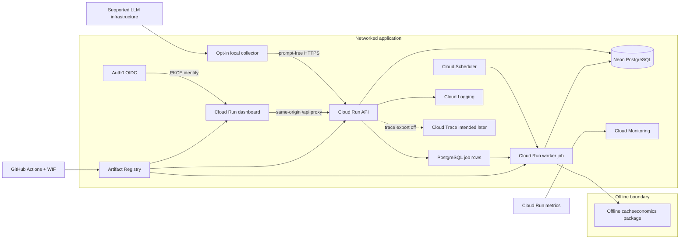
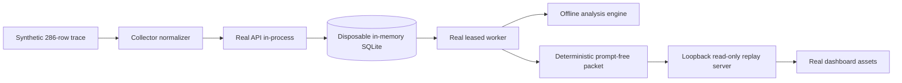

# Architecture

## The rule that shapes the system

The installed `cacheeconomics` Python package is a local calculator. It reads
local data, analyzes it, and writes local output. It does not open network
connections. That promise remains part of the product contract.

Anything that needs the internet—login, organizations, ingestion endpoints,
scheduled jobs, a shared database, or a hosted dashboard—belongs in a separate
application. The local package must still be useful without that application.

## What exists after the staging design phase

```mermaid
flowchart TB
    subgraph Local and socket-free
        Files[Local trace files] --> Core[cacheeconomics Python package]
        CLI[Local CLI] --> Core
        Core --> Reports[Terminal / Markdown / JSON reports]
        Demo[Static browser demo] --> BrowserWorker[Browser Python worker]
        BrowserWorker --> Core
    end

    subgraph Separate networked control plane
        IdP[External OIDC provider] -->|Signed identity token| API[FastAPI service]
        API --> DB[(PostgreSQL with row-level security)]
        API --> Audit[Append-only audit events]
        Collector[Opt-in LiteLLM / file collector] -->|Prompt-free batches| API
        API --> Jobs[(PostgreSQL job rows)]
        Jobs --> Worker[Restricted analysis worker]
        Worker --> CoreCopy[Same offline analysis engine]
        Worker --> DB
        Browser[Hosted dashboard] -->|Same-origin authenticated API| API
        API --> Metrics[Prometheus-format metrics]
        API --> Logs[Allow-listed JSON logs]
        API -.->|Explicitly configured OTLP| Telemetry[Telemetry backend]
        Worker -.->|Explicitly configured OTLP| Telemetry
    end

    subgraph Delivery controls
        CI[GitHub tests + evaluations] --> Images[Role-specific images]
        Images --> Scan[Image scan + SBOM]
        Scan --> Attest[Signed build provenance]
        Attest --> Stage[Cloud Run staging by digest]
        Stage -->|Explicit approval, same digest| Prod[Production image digest]
    end
```

The repository now contains the original analysis engine, adapters, CLI, tests,
and static browser demo plus a separately packaged control-plane service. The
service implements external OIDC verification, organizations, memberships,
RBAC, source credentials, audit events, prompt-free ingestion, source health,
durable jobs, analysis results, bounded dashboard aggregates, database
migrations, and a development Docker Compose stack. The separate collector
provides the only new telemetry upload client. The dashboard, safe logs,
service metrics, optional OpenTelemetry instrumentation, and baseline alert
rules now exist. GitHub, Cloud Run, Artifact Registry, Secret Manager, Neon,
and Auth0 are selected for a low-traffic staging target. Their infrastructure
and deployment definitions exist, but they have not been applied, so this is
not a claim that a public environment is running.

## Selected provider shape

The diagram names the selected services and trust boundaries. It is a target
implemented in code and configuration, not proof that those services are
currently deployed. OpenTelemetry export deliberately remains disabled until a
staging redaction review is recorded.

## Repository boundaries

The implementation is separated into these areas:

| Area | Responsibility | Network allowed? |
| --- | --- | --- |
| `harness/cacheeconomics/` | Analysis, pricing registry, local adapters, reports | No |
| `schemas/` | Versioned data exchanged with an application | No |
| `web/` | Existing static demo and browser worker | Browser only |
| `collectors/` | Opt-in collection and upload | Yes |
| `services/control_plane/` | Authentication, organizations, RBAC, API | Yes |
| `services/control_plane/.../worker.py` | Scheduled analysis jobs | Database and explicitly configured telemetry |
| `apps/dashboard/` | Hosted user interface | Yes |
| `evals/` | Accuracy, privacy, tenancy, and regression checks | Only in explicit integration tests |
| `deploy/` | Containers and deployment configuration | Yes at runtime |

The collector, API, PostgreSQL job queue, worker, migrations,
dashboard container, operational instrumentation, local deployment
configuration, evaluation suite, production image definitions, security scans,
SBOM generation, backup/restore exercise, and digest-preserving promotion
workflow exist. The selected staging provider definitions are under
`deploy/gcp/` and `.github/workflows/deploy-gcp-staging.yml`. A public staging
or production runtime still does not exist until an operator applies them.

## Portfolio demo data flow

The Phase 5 local demo exercises the application path without claiming a cloud
deployment:

Random identifiers, database timestamps, and job runtime are normalized only
after the flow completes so the packet is stable enough for review. The timing
fields displayed by Operations are assigned synthetic scenario inputs. The
packet is not evidence of PostgreSQL row security, cloud availability, service
capacity, or realized savings.

## Data flow

1. An operator installs and explicitly starts a collector near their LLM
   infrastructure.
2. The collector normalizes supported telemetry locally.
3. It removes raw prompt/completion content. If structural comparison is needed,
   it sends keyed HMAC fingerprints created locally.
4. It sends a versioned ingest event over HTTPS using a source credential.
5. The API derives the organization from that credential. It never trusts an
   organization ID supplied by an event body.
6. A worker converts stored events into the existing local `Request` model and
   runs the existing analyzer.
7. The worker stores the versioned analysis result. Withheld figures remain
   withheld and have no numeric amount in that result.
8. Nginx serves the dashboard and proxies `/api/` to the control plane. The
   browser sends an in-memory OIDC bearer token and the selected organization
   ID; it receives only authorized, organization-scoped responses.
9. The API exposes bounded operational aggregates, not raw event rows. Metrics
   use route templates without tenant labels. JSON logs contain only explicitly
   allow-listed scalar fields.
10. OpenTelemetry exporters default to `none`. The selected staging definition
    keeps them off until a recorded trace-attribute privacy review is complete.

## Initial support boundary

The first live collector wraps the repository's existing LiteLLM callback. It
is the only live integration claimed in Phase 2. Explicit network upload is
implemented for normalized traces and usage-only LiteLLM JSONL. Request-body
and Claude Code files remain local-only until their hosted paths receive the
same privacy and end-to-end tests.

This plan does not claim that every LLM provider exposes live cache telemetry.
A source is supported only after a recorded fixture, parser tests, and an
end-to-end ingestion test prove the fields it supplies. Unknown models or
targets remain unpriced instead of being guessed.

## Compatibility rules

- Existing CLI commands and formats remain available.
- The core package keeps an empty mandatory dependency list and the socket-ban
  regression test.
- Hosted code may import the core package. Core code may not import hosted code.
- Registry version and digest travel with each analysis result so old results
  remain explainable after pricing data changes.
- Breaking exchange-format changes require a new schema version.
