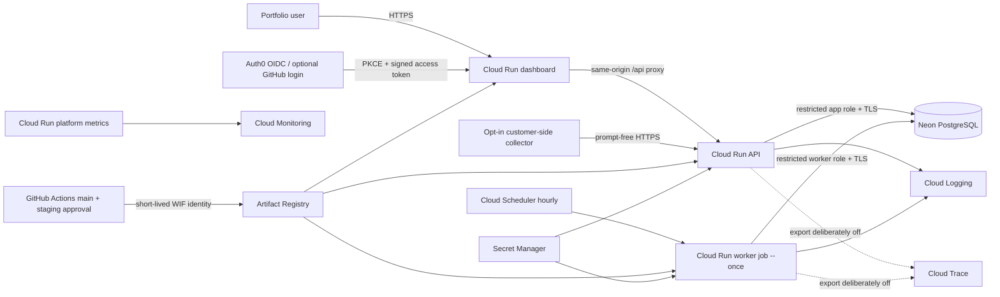

# Staging deployment decision record

**Decision date:** 2026-09-07

**Scope:** low-traffic public portfolio staging, not customer production

**State:** selected and implemented as deployment definitions; not yet applied

The chosen design favors services with usable free allowances and keeps the
number of moving parts small. Free allowances can change and are not hard cost
caps. Google Cloud requires billing, so the operator must create a budget alert
and review usage.

| Decision | Selected service | Reason and current limit |
| --- | --- | --- |
| Source and automation | GitHub + GitHub Actions | Public-repository CI and OIDC-based deployment; GitHub does not host the Python API |
| Container runtime | Google Cloud Run | Scale-to-zero services plus bounded jobs; staging is capped at one API and one dashboard instance |
| Container registry | Google Artifact Registry | Regional digest-addressed images used directly by Cloud Run |
| Managed PostgreSQL | Neon Free | PostgreSQL and separate SQL roles; limited free storage/recovery means staging only |
| Human identity | Auth0 Free | OIDC, RS256, and Authorization Code with PKCE; optional GitHub social connection |
| Secrets | Google Secret Manager | Per-runtime access to operator-added secret versions |
| Workload identity | GitHub OIDC → Google Workload Identity Federation | No long-lived Google service-account key in GitHub |
| DNS and TLS | Cloud Run managed `run.app` domains | Managed HTTPS for staging; custom domain intentionally deferred |
| Logs and platform metrics | Google Cloud Logging and Cloud Monitoring | Cloud Run request/error/latency and job state, plus allow-listed app JSON logs |
| Product health | Existing dashboard and protected `/metrics` endpoint | Exact ingestion/job state is visible; Prometheus scraping is not configured in this staging definition |
| Distributed traces | Google Cloud Trace is the intended later backend | Export remains off until a staging redaction review; no trace integration is claimed yet |

## Selected staging architecture

The collector is intentionally outside Cloud Run. It is installed and started
only where an operator has opted in to observe supported LLM infrastructure.
The local `cacheeconomics` package remains in the worker image as an offline
analysis library and still has no networking code.

## Security decisions

- Public Cloud Run ingress is required because Auth0 and collectors authenticate
  at the application boundary. API endpoints still require either an OIDC token
  or a source-scoped collector token; only health/configuration routes are
  intentionally anonymous.
- GitHub can impersonate only the deployer service account, only from this
  repository, and only from `refs/heads/main`. Each runtime has a separate
  identity and can read only its required secret containers.
- Three separate Neon roles preserve migration ownership and runtime row-level
  security. None may be a superuser, create roles/databases, inherit the Neon
  administrative role, or bypass row security.
- Images are scanned, attested, and deployed by digest. Database migration runs
  as a one-shot job before service rollout.
- OpenTelemetry exporters stay `none`. Cloud Run's own request telemetry and
  stdout collection do not require application trace export.

## Evidence still required before the word “deployed” is used

1. Terraform plan/apply output and exact provider/resource locations.
2. Digest-qualified staging image references and matching attestations.
3. Successful migration, synthetic smoke flow, and real PostgreSQL
   tenant-isolation output.
4. Backup/restore output showing restored ACLs and restricted-role access.
5. Cloud Logging review and a decision on safe trace attribute redaction.
6. Incident, scheduler-failure, credential-revocation, and rollback drills.
7. Auth0 callback/issuer/audience evidence with secret values removed.
8. Actual usage/cost review; no savings, uptime, or capacity figure may be
   inferred from the provider's free allowance.

The detailed operator procedure is in `deploy/gcp/README.md`.
